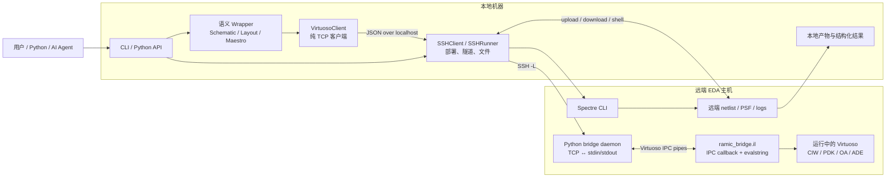
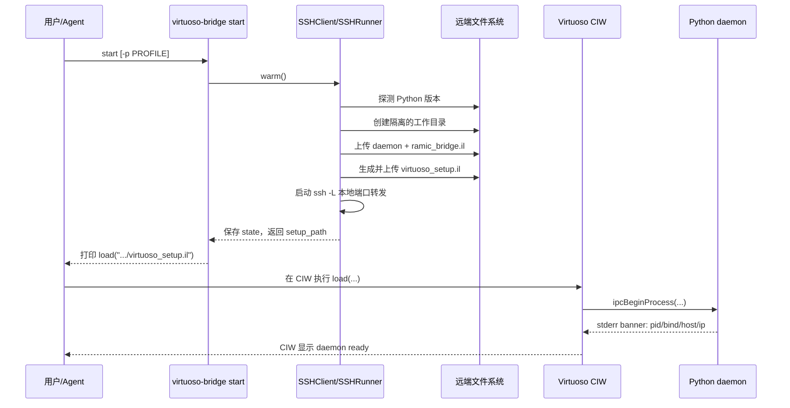
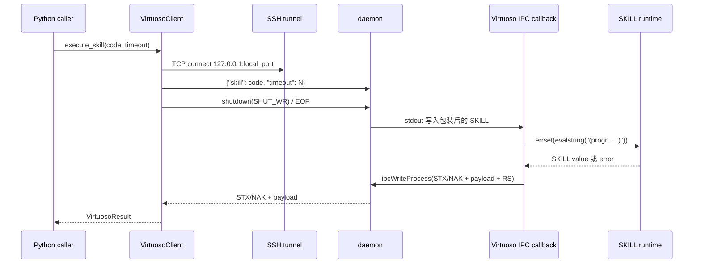
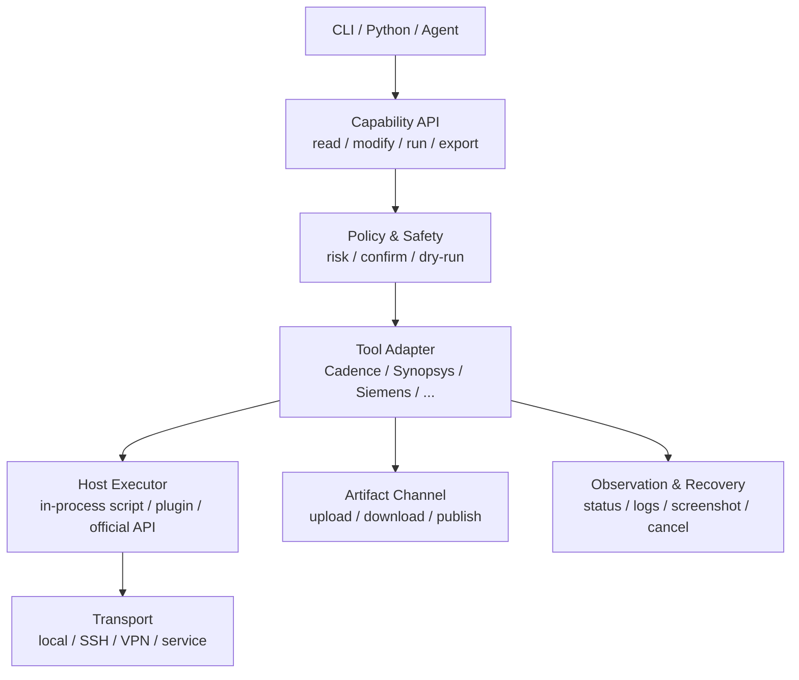

# virtuoso-bridge-lite 学习与 EDA 远程控制仿制指南

> 面向希望理解本项目，并将其架构迁移到其他 EDA 软件的开发者。
>
> 分析基线：`virtuoso-bridge` 0.7.0，仓库主分支，2026-08-07。

## 1. 先建立正确的心智模型

`virtuoso-bridge-lite` 不是简单的“SSH 远程执行器”，也不是用 Python
重新实现 Cadence SKILL API。它解决的是一个更具体的问题：

> 让本地 Python 程序或 AI Agent 能够远程调用**已经运行的 Virtuoso GUI
> 进程**，并在这个进程现有的 CIW、窗口、库、PDK 和 Maestro 上下文内执行
> 原生 SKILL。

项目采用“传输与宿主执行分离”的设计：

- SSH 负责到达远端、部署文件、建立加密端口转发和传输产物。
- Python TCP daemon 负责在网络请求和 Virtuoso IPC 管道之间转换。
- `ramic_bridge.il` 运行在 Virtuoso 内，通过 `evalstring()` 执行 SKILL。
- 高层 Python wrapper 把验证过的 SKILL 操作提升为更安全、可测试的语义 API。
- CLI、结构化结果、examples 和 agent skills 让这套能力适合自动化与 AI Agent。

如果只记住一件事，应当是：

> SSH 只是路，Virtuoso 进程内的脚本执行入口才是桥。

## 2. 为什么不能只使用 SSH

SSH 可以启动 shell 命令，也可以启动一个新的 batch Virtuoso 进程，但新进程不会
自动继承当前 GUI 会话中的状态，例如：

- 当前打开和聚焦的 schematic、layout、Maestro 窗口；
- 当前编辑 cellview、选择集和未保存修改；
- 已加载的 PDK、CDF 回调和 `.cdsinit` 环境；
- 已打开的 ADE/Maestro session、history 和仿真结果；
- 当前 Virtuoso 进程内才存在的对象句柄。

因此本项目没有把“远端 shell”误当成“远端 GUI 会话控制”。它通过 Virtuoso 的
`ipcBeginProcess()` 启动一个受 Virtuoso 管理的子进程，并使用子进程的标准输入、
标准输出和标准错误建立双向通道。SKILL 仍然由目标 Virtuoso 进程执行，所以执行
上下文与用户当前工作的会话一致。

这是仿制其他 EDA 控制桥时首先要回答的问题：

> 目标软件提供什么方式，让外部程序进入**现有进程的应用上下文**？

候选入口可能是嵌入式 Python/Tcl、插件 API、COM、Java API、RPC、socket console、
命名管道或宿主提供的子进程 IPC。只有完全没有进程内入口时，才考虑 GUI 自动化；
GUI 自动化应当是最后的恢复或补充手段，而不是主控制面。

## 3. 四个平面的总体架构

将整个项目理解为四个相互配合、但可以独立演进的平面最为清晰。

| 平面 | 主要职责 | 代表实现 |
| --- | --- | --- |
| 控制面 | 配置发现、profile、启动停止、部署、隧道、状态检查 | `env.py`、`profile.py`、`cli.py`、`transport/` |
| 执行面 | 请求封装、TCP 协议、IPC 转换、进程内脚本执行 | `VirtuosoClient`、daemon、`ramic_bridge.il` |
| 产物面 | 上传下载、远程临时目录、日志、快照、仿真结果 | `SSHRunner`、Maestro snapshot、Spectre runner |
| 知识面 | 语义 wrapper、读写器、示例、文档、agent skills | `virtuoso/*`、`examples/`、`skills/`、`AGENTS.md` |



图中有两条刻意分开的主路径：

1. Virtuoso 路径：通过 daemon 和 IPC 进入正在运行的 GUI 进程。
2. Spectre 路径：通过 SSH 运行独立命令行模拟器并下载结果。

它们共享 SSH 基础设施，但不互相依赖。

## 4. 核心组件与职责边界

### 4.1 `VirtuosoClient`：纯 TCP 执行客户端

入口位于
[`src/virtuoso_bridge/virtuoso/basic/bridge.py`](../src/virtuoso_bridge/virtuoso/basic/bridge.py)。

它的核心职责很小：

1. 把 SKILL 文本和 timeout 编码成 JSON；
2. 连接一个 host/port；
3. 发送请求并关闭写方向，以 EOF 表示请求结束；
4. 读取完整响应；
5. 将响应转换为 `VirtuosoResult`。

它不直接理解 SSH。构造方式体现了这个边界：

- `VirtuosoClient.local()`：直接连接本机 daemon；
- `VirtuosoClient.from_tunnel()`：使用已经准备好的 `SSHClient`；
- `VirtuosoClient.from_env()`：为使用方便组合配置解析和 tunnel，但最终仍连接
  `127.0.0.1:<local_port>`。

这种分离使客户端可以工作在 SSH tunnel、VPN、容器端口、直接局域网或测试替身上。

### 4.2 `SSHClient`：bridge 生命周期编排

入口位于
[`src/virtuoso_bridge/transport/tunnel.py`](../src/virtuoso_bridge/transport/tunnel.py)。

它负责：

- 根据环境变量创建 `SSHRunner`；
- 探测远端 Python 版本；
- 选择 Python 3 或 Python 2.7 daemon；
- 上传 daemon 和 `ramic_bridge.il`；
- 生成并上传 `virtuoso_setup.il`；
- 建立 `local_port -> remote 127.0.0.1:remote_port` 转发；
- 保存 tunnel 状态文件，供后续 Python/CLI 进程复用；
- 在 local mode 下跳过 SSH，生成本地 setup 文件。

`SSHClient` 是 orchestration facade；实际 shell、端口转发和文件传输由
`SSHRunner` 完成。

### 4.3 `SSHRunner`：通用远端传输层

入口位于
[`src/virtuoso_bridge/transport/ssh.py`](../src/virtuoso_bridge/transport/ssh.py)。

它把 OpenSSH CLI 封装成可复用的 transport：

- 支持 jump host；
- 支持 ControlMaster 连接复用；
- 在合适平台支持长驻的 `ssh host sh -s` shell；
- 管理端口转发进程；
- 统一命令 timeout 和错误摘要；
- 通过 tar 管道批量上传或下载目录；
- 对瞬时 SSH 错误和 ControlMaster 故障进行有限重试/降级。

它不是 Virtuoso 专用层，因此 Spectre、文档搜索、X11 恢复和文件型工作流都可以
复用它。

### 4.4 Python daemon：网络与 IPC 之间的适配器

Python 3 与 2.7 版本分别位于：

- [`ramic_bridge_daemon_3.py`](../src/virtuoso_bridge/virtuoso/basic/resources/ramic_bridge_daemon_3.py)
- [`ramic_bridge_daemon_27.py`](../src/virtuoso_bridge/virtuoso/basic/resources/ramic_bridge_daemon_27.py)

daemon 不实现 schematic、layout 或 Maestro API。它只负责：

- 监听 TCP；
- 解码 JSON；
- 将 SKILL 写入 stdout，由 Virtuoso IPC callback 接收；
- 从 stdin 读取 Virtuoso 返回的帧；
- 将结果返回 TCP 客户端；
- 管理请求超时、临时 `.il` 文件和运行统计。

这种“机制层不包含领域 API”的边界非常重要。它让协议保持小而稳定，新增 EDA
能力时主要修改 wrapper，而不是修改网络 daemon。

### 4.5 `ramic_bridge.il`：真正进入 Virtuoso 的桥

入口位于
[`ramic_bridge.il`](../src/virtuoso_bridge/virtuoso/basic/resources/ramic_bridge.il)。

关键函数是：

- `RBStart()`：通过 `ipcBeginProcess()` 启动 Python daemon；
- `RBIpcDataHandler()`：接收 daemon stdout，调用 `evalstring()`；
- `ipcWriteProcess()`：将结果写回 daemon stdin；
- `RBIpcErrHandler()`：解析 daemon banner、统计和错误；
- `RBIpcFinishHandler()`：处理 daemon 退出；
- `RBStop()` / `RBStopAll()`：停止当前或清理本用户 daemon；
- `RBMRefresh()` 等：提供 CIW 内的 daemon monitor。

`RBIpcDataHandler()` 使用 `errset()` 捕获 SKILL 错误，并用控制字符区分成功与失败。
这意味着异常边界位于宿主进程内，而不是靠客户端猜测字符串是否像错误。

## 5. 启动和部署链路

### 5.1 远程模式启动时序



CLI 无法凭 SSH 自动选择用户想控制的某个 Virtuoso GUI 进程。因此，首次执行
`load(...)` 是有意保留的 bootstrap：用户在目标 CIW 中加载 setup 文件，就等于
明确选择了要附着的进程。之后可将相同 `load(...)` 放入远端 `.cdsinit` 自动完成。

### 5.2 setup 文件的作用

`virtuoso_setup.il` 由本地动态生成，内容主要是：

1. 设置 `RB_DAEMON_PATH`；
2. 设置 `RB_PYTHON_PATH`；
3. 设置 `RB_PORT`；
4. 加载 `ramic_bridge.il`。

路径和端口不硬编码在通用 SKILL 文件中，因此同一远端用户、不同本地客户端和不同
profile 可以部署互不覆盖的实例。

### 5.3 远程目录隔离

默认目录形态为：

```text
<scratch-root>/virtuoso_bridge_<remote-user>/<client-id>/<profile-leaf>/
```

默认 scratch root 是 `/tmp`，也可以通过 `VB_REMOTE_SCRATCH_ROOT` 覆盖。

隔离维度包括：

- 远端 Unix 用户；
- 本地 client ID；
- connection profile。

这解决了共享服务器上的三类冲突：不同远端用户、同一远端账号的不同本地机器、同一
机器连接多个 Virtuoso 实例。

## 6. 一次 SKILL 请求的完整时序



### 6.1 请求格式

当前请求是一个 JSON 对象：

```json
{
  "skill": "1+2",
  "timeout": 30
}
```

协议没有长度前缀；客户端发送完 JSON 后关闭 socket 写方向，daemon 读取到 EOF 后
开始解析。因此当前协议是一条 TCP 连接承载一个请求。

### 6.2 响应格式

Virtuoso IPC 侧使用控制字符分帧：

| 字符 | 十六进制 | 含义 |
| --- | --- | --- |
| STX | `0x02` | 成功响应开始 |
| NAK | `0x15` | 错误响应开始 |
| RS | `0x1e` | IPC 响应结束 |

daemon 读取到 RS 后停止，但返回客户端的内容只保留 STX/NAK 和 payload。客户端据此
构造 `VirtuosoResult(status, output, errors, execution_time)`。

### 6.3 单行与多行 SKILL

单行代码会包装成类似：

```skill
let(((__vb_r 1+2)) hiFlush() __vb_r)
```

多行代码不能简单压成一行，因为 SKILL 的 `;` 注释可能吞掉后续表达式。daemon 会：

1. 创建临时 `.il` 文件；
2. 写入 `_vb_eval_result = progn(...)`；
3. 让 Virtuoso 执行 `load(path)`；
4. 返回 `_vb_eval_result`；
5. 删除临时文件。

这既保留了注释和多表达式语义，又绕过了 `load()` 只返回 `t`、不返回最后表达式值的
问题。

### 6.4 并发模型

当前 daemon 的 accept loop 串行处理请求：`listen(1)` 后，每次完整处理一个连接再
接受下一个连接。这与 Virtuoso GUI/CIW 的单事件循环特性相匹配，也避免两个写操作
同时修改 cellview。

因此不能把“多个客户端都能连接”误解成“SKILL 可以并行执行”。真正的并行任务应优先
放到独立 Spectre 进程、不同 Virtuoso session、不同 profile 或不同服务器中。

## 7. Timeout、取消与故障边界

本项目在两个位置实施 timeout：

### 7.1 客户端绝对 deadline

`VirtuosoClient.execute_skill()` 使用一个贯穿 connect、retry、send 和 recv 的绝对
deadline。这样重试不会在每个阶段重新获得完整 timeout，避免总耗时无限膨胀。

跳板机建立 tunnel 后可能短暂拒绝连接，因此客户端允许一个有限的 connection grace
window；仍然受总 deadline 约束。

### 7.2 daemon watchdog

daemon 为请求启动 timer。如果 Virtuoso 没有按时返回，watchdog 向检测到的
Virtuoso PID 发送 `SIGINT`，尝试中断被卡住的 SKILL。

这是务实但侵入性较强的恢复机制：

- 优点：单个永久阻塞的请求不会永远占住 bridge；
- 风险：信号作用于整个 Virtuoso 进程，而不是一个具有 request ID 的隔离任务；
- 限制：无法表达“客户端取消但宿主继续完成”“查询状态”“部分结果”等语义。

仿制新 EDA bridge 时，应优先使用目标软件提供的 task/job handle 和官方 cancel API；
只有宿主没有细粒度取消能力时，才退回进程级信号。

### 7.3 GUI 模态框是另一条故障路径

如果模态对话框阻塞 Virtuoso 的事件循环，SKILL 通道自身也会阻塞，无法依靠
`execute_skill()` 关闭对话框。因此项目提供独立于 SKILL 通道的 X11 恢复路径：

- `dismiss-dialog`；
- `list-windows --json`；
- `dismiss-window WINDOW_ID --action ...`。

这体现了一个可迁移的设计原则：

> 主控制通道必须配套一个不依赖主通道的观察/恢复通道。

## 8. 配置、profile 与状态管理

### 8.1 `.env` 解析顺序

配置解析集中在
[`env.py`](../src/virtuoso_bridge/env.py)。优先级是：

1. 显式 `--env FILE` 或运行时指定文件；
2. 从当前目录向上查找第一个包含 `VB_REMOTE_HOST` 或 `VB_LOCAL_PORT` 的 `.env`；
3. 用户级 `~/.virtuoso-bridge/.env`。

它不会盲目加载路径上的任意 `.env`，从而降低误加载其他项目环境变量的风险。

### 8.2 profile

多实例配置使用大小写敏感的环境变量后缀：

```dotenv
VB_REMOTE_HOST_worker1=server-b
VB_REMOTE_USER_worker1=user2
VB_REMOTE_PORT_worker1=65271
```

profile 解析顺序包括：显式参数、`VB_PROFILE`、运行时 env、virtualenv binding、用户级
env 和默认 profile。把 profile 绑定到 virtualenv 的价值是：即使业务代码只调用
`VirtuosoClient.from_env()`，它也能稳定连接到预期实例。

### 8.3 runtime path policy

日志、状态、缓存、临时文件和用户产物统一通过
[`runtime_paths.py`](../src/virtuoso_bridge/runtime_paths.py) 解析，避免把运行时文件写进
Git 仓库。路径函数本身不创建目录，写入者在真正需要时创建，因此普通 import 保持
无副作用。

### 8.4 tunnel 状态文件

`SSHClient.save_state()` 保存：

- local/remote mode；
- 本地连接端口；
- tunnel PID；
- remote host；
- setup path；
- profile；
- 启动时间。

后续 CLI 或 Python 进程据此复用已经存在的 tunnel，而不是每次重新握手。

状态文件是“发现信息”，不是绝对事实；健壮实现仍需检查端口、进程和 daemon 响应，
并正确处理 PID 复用、跨平台进程探测和 stale state。

## 9. 高层 Python API 的分层方式

项目没有试图自动映射全部 SKILL 函数，而是采用“raw escape hatch + 验证过的语义
wrapper”模式。

### 9.1 五层结构

| 层 | 作用 | 示例 |
| --- | --- | --- |
| L0 原始执行 | 执行任意已确认的宿主脚本 | `client.execute_skill(...)` |
| L1 builder | 验证参数并生成可审计的 SKILL 字符串 | `schematic/ops.py`、`layout/ops.py` |
| L2 editor | 聚合操作并管理 open/check/save 生命周期 | `SchematicEditor`、`LayoutEditor` |
| L3 reader/workflow | 结构化读取或编排多步操作与产物 | schematic reader、Maestro reader/writer |
| L4 facade/CLI | 稳定、易发现的用户和 Agent 接口 | `client.schematic.*`、CLI 子命令 |

### 9.2 builder 保持传输无关

例如 `schematic_create_wire()` 只把 Python 参数变成正确转义和格式化的 SKILL 文本，
并不知道 TCP 或 SSH。这带来三个好处：

- 可以不连接 Virtuoso 就测试生成内容；
- raw SKILL 可检查、可记录、可复制到 CIW 调试；
- transport、领域逻辑和生命周期错误不会混在一起。

### 9.3 editor 显式表达破坏性

schematic、layout、symbol 都区分：

- `create()`：使用写模式创建/覆盖；
- `modify()`：使用 append 模式修改现有 cellview；
- 旧 `edit()`：弃用并默认安全的 append 模式。

调用点必须明确表达覆盖意图，这是面向 Agent 的重要安全设计。自然语言中的“编辑”很
容易被误解；API 通过动词和 mode 消除歧义。

`SchematicEditor` 在 context manager 正常退出时批量执行：

```text
open cellview -> queued operations -> schCheck -> dbSave
```

如果 Python context 内发生异常，则不提交后续 batch。它不是数据库事务，也不能保证
宿主层回滚，但把保存边界集中到了一个可见位置。

### 9.4 reader 优先返回结构而不是截图

schematic reader 通过 SKILL 查询 instances、nets、pins、参数和可选几何，并在 Python
端解析成字典。Maestro reader 读取 session、test、analysis、corner、history 和磁盘
产物。

对 AI Agent 来说，结构化数据优于截图：

- 稳定，不受主题、缩放和窗口遮挡影响；
- 可比较、过滤和验证；
- 能明确表达数据库对象身份；
- token 成本通常更低。

截图保留给视觉状态、模态框、波形外观和结构化 API 无法覆盖的问题。

### 9.5 统一结果模型

[`models.py`](../src/virtuoso_bridge/models.py) 使用 Pydantic 定义
`VirtuosoResult` 和 `SimulationResult`，统一包含：

- `status`；
- `output` 或 `data`；
- `errors`、`warnings`；
- `metadata`；
- 执行时间等附加信息。

CLI 可以稳定输出 JSON，Python 调用者可以使用 `result.ok`，Agent 不必解析散乱的
stdout。这是 AI-native 的基础设施，而不只是数据模型上的美化。

## 10. 文件与产物是完整控制闭环的一部分

EDA 自动化不能只支持 RPC。很多真正有价值的输入输出是文件：

- 输入：`.il`、Verilog-A、CDL、Spectre netlist、GDS、配置文件；
- 输出：PSF、netlist、日志、截图、XML、SQLite/RDB、GDS、报告。

本项目让 `VirtuosoClient` 暴露 `upload_file()` / `download_file()`，但实际传输委托给
tunnel/SSH 层；local mode 则退化为受检查的本地复制。

好的文件型工作流通常遵守以下模式：

```text
本地校验输入
  -> 创建唯一的远端工作目录
  -> 上传/暂存输入
  -> 在宿主或 CLI 工具中启动操作
  -> 同时轮询目标产物和工具日志
  -> 验证大小、格式、digest 或完成标记
  -> 下载到临时本地路径
  -> 原子发布最终产物
  -> 按保留策略清理
```

不能只相信 shell 返回码。Cadence 某些工具会 fork 后返回，或把最终失败写入自己的
日志。因此项目在 GDS/netlist 等复杂路径中同时检查：

- 目标产物是否出现；
- 日志中是否出现 terminal failure marker；
- 远程命令和下载是否成功；
- 新产物验证完成前是否应保留旧产物。

这种“产物 + 日志 + 协议 sentinel”三重判断是其他 EDA 自动化同样需要的可靠性模式。

## 11. Spectre 为什么是独立服务

[`SpectreSimulator`](../src/virtuoso_bridge/spectre/runner.py) 不通过 CIW daemon。
它直接在本地或 SSH 远端运行 `spectre`，然后解析 PSF ASCII 结果。

原因是 Spectre 本身就是可脚本化的 headless CLI，没有必要绕进 Virtuoso GUI。把两者
强行耦合会增加故障面，并让没有 GUI 的批量仿真无法使用。

Spectre 路径复用：

- profile 和 `.env`；
- `SSHRunner` / ControlMaster；
- 远端用户与 client ID 隔离；
- 统一的 `SimulationResult`；
- runtime artifact 目录。

并行仿真使用 thread pool 编排多个独立 Spectre 进程，每个任务获得唯一的本地和远端
工作目录。这里可以并行，是因为每个 Spectre 进程拥有独立状态；这与单一 CIW 内的
串行 SKILL 执行形成清晰对比。

可迁移原则是：

> 同一软件套件中的 GUI、求解器、转换器和查看器不一定属于同一控制通道；按它们真实
> 的生命周期和并发模型拆分适配器。

## 12. “AI-native”具体体现在哪里

AI-native 不是简单地允许 LLM 生成 SKILL。项目真正适合 Agent 的原因包括：

### 12.1 确定性的机器入口

- CLI-first，常见动作不要求人工点击 GUI；
- JSON 结果和明确 exit code；
- raw SKILL escape hatch 与高层 API 并存；
- local/remote 使用相同 Python 接口。

### 12.2 可发现的语义能力

- `client.schematic`、`layout`、`symbol`、`maestro` 按领域组织；
- `create()` / `modify()` 明确风险；
- examples 展示最小完整工作流；
- SKILL Finder 和 Cadence docs search 帮助验证函数，而不是凭模型记忆猜 API。

### 12.3 上下文压缩

Agent 不需要每次重新理解 SSH、IPC、SKILL quoting 和 PDK 细节。wrapper 把已验证的
知识压缩成稳定调用，reader 把大量 GUI/数据库状态压缩成结构化数据，snapshot filter
把巨大的 Maestro 目录压缩为高信号产物。

### 12.4 操作规范随代码分发

`AGENTS.md` 和 `skills/` 不只是用户教程，而是 Agent 的运行手册，描述：

- 何时使用哪个 API；
- 先读后写和 destructive operation 约束；
- 已验证的 Cadence gotcha；
- 仿真、netlist、Maestro 的正确步骤；
- 超时、对话框和文件失败的恢复策略。

### 12.5 可观察和可恢复

Agent 可以检查 status、windows、snapshot、日志和截图；主通道卡死时还有 X11 恢复
通道。没有可观察性和恢复能力的“自动控制”只能做 demo，难以成为 agent infrastructure。

## 13. 可靠性设计中值得复用的细节

### 13.1 兼容远端遗留环境

远端可能只有 Python 2.7，也可能有 Cadence 自带 Python 3。启动流程按顺序探测解释器，
选择对应 daemon 文件，而不是假设服务器与本地开发环境相同。

### 13.2 清理 Virtuoso 注入的动态库变量

daemon 作为 Virtuoso 子进程会继承 `LD_LIBRARY_PATH` / `LD_PRELOAD`，这些变量可能让
系统 Python 错误链接到 Cadence 自带旧库。因此 `RBStart()` 使用 `/usr/bin/env -u`
删除相关变量后再启动 Python。

这类“宿主环境污染子进程”的问题在大型 EDA 套件中非常常见，应在新适配器中主动检查。

### 13.3 避免 daemon 重复启动

重新 `load()` SKILL 文件不会替换已运行 daemon。`ramic_bridge.il` 保留 IPC handle，
检测 live/zombie 状态，并提示用户先 `RBStop()`。否则旧 daemon 占用端口，新 daemon
立即 bind 失败，但表面上 setup 文件似乎已经成功加载。

### 13.4 本地端口冲突自动处理

remote daemon port 与 local tunnel port 是两个概念。本地端口被占用时，tunnel 层会
尝试后续端口并更新配置；远端 daemon 仍监听原端口。

### 13.5 cross-user daemon guard

在共享服务器上，本地 tunnel 可能意外连到另一个用户遗留的 daemon。客户端查询
daemon 内的 `$USER`，与配置的 `VB_REMOTE_USER` 比较；不匹配时默认拒绝，只有显式
override 才允许。

### 13.6 CIW 输出与返回值分离

`execute_skill()` 获取表达式返回值，但默认不把它显示在 CIW。需要 CIW 可见输出时应
显式 `printf(...\n)`。`evalstring()` 与交互式 CIW 的 flush 行为不同，因此 daemon
包装中包含 `hiFlush()`。

### 13.7 命令失败不能等同于领域失败

项目区分：

- SSH transport error；
- shell process return code；
- SKILL error；
- 工具日志中的领域错误；
- 产物缺失或格式错误；
- timeout / incomplete。

其他 EDA bridge 也应建立类似的分层错误 taxonomy，避免所有失败都退化成一个字符串。

## 14. 当前协议与安全边界

本节描述的是当前实现边界，不等于所有部署都存在漏洞，也不应被忽略。

### 14.1 信任模型

正常远程流量通过 SSH local forwarding，客户端连接本地 `127.0.0.1`。但是当前
`ramic_bridge.il` 的 `RBLocal` 默认是 `nil`，daemon 因而监听远端 `0.0.0.0`。

daemon 协议自身没有认证，而且能力等价于在目标 Virtuoso 会话执行任意 SKILL。因此
它只适用于受信任网络、受控主机和正确的防火墙策略。

仿制项目建议默认：

- daemon 只绑定 `127.0.0.1` 或 Unix domain socket；
- 所有远程访问强制经过 SSH/VPN/受认证代理；
- 必须远程监听时增加强认证、加密和来源限制；
- 记录操作者、目标实例、请求 ID 和风险级别；
- 对 payload 大小、timeout 范围和并发数设置上限。

### 14.2 协议缺少的能力

当前极简协议没有：

- 协议版本和 capability negotiation；
- request ID；
- 独立认证；
- 长度前缀或 streaming；
- 查询任务状态和细粒度 cancel；
- 幂等键；
- 多租户授权；
- backpressure 和正式队列。

这些缺失不妨碍单用户、SSH 隔离的实用场景，但如果要发展成团队服务或通用 EDA
control platform，应设计 protocol v2，而不是继续向当前 JSON 加隐式字段。

### 14.3 写操作安全

建议把写操作进一步分类：

| 风险级别 | 示例 | 推荐保护 |
| --- | --- | --- |
| Read | 查询版本、窗口、拓扑 | 默认允许，仍需 timeout |
| Modify | 修改当前 cellview、变量 | 明确目标、保存边界、操作摘要 |
| Replace | `create()` 覆盖 cellview | 显式 overwrite、备份或 dry-run |
| External | GDS/netlist import/export、shell tool | 隔离目录、日志轮询、产物验证 |
| Destructive | 删除 library/cell/history | 二次确认、精确目标、审计记录 |

## 15. 测试策略

仓库当前约有 68 个 Python 源文件、2.17 万行源码、37 个测试文件和 509 个测试用例。
测试重点说明了作者认为哪些地方最容易出错。

### 15.1 daemon-free 单元测试

大量测试使用 fake client、fake socket、fake SSH runner 或固定日志，无需真实 Cadence：

- SKILL builder 的转义、参数映射和括号结构；
- response parser 和日志 parser；
- profile、路径与 remote scratch 隔离；
- timeout 是否贯穿所有 socket 阶段；
- create/modify 的安全语义；
- CLI 参数、JSON 输出和 exit code；
- 文件发布、清理和失败保留策略。

这使绝大多数控制逻辑可以在 CI 环境验证。

### 15.2 live integration test

需要真实 Virtuoso 的测试应聚焦于无法用字符串测试证明的语义：

- SKILL 函数在目标 IC 版本是否存在；
- PDK/CDF 行为；
- cellview 修改后的数据库结果；
- Maestro session 和 simulation lifecycle；
- GDS/netlist 工具实际产物；
- GUI 模态框和 X11 恢复。

### 15.3 推荐的测试金字塔

```text
少量：真实 EDA 端到端验收
  中量：录制的日志/产物 fixture + transport fake
    大量：纯 builder、parser、状态机、路径与策略单元测试
```

对商业 EDA 软件而言，license、GUI 和 PDK 使 live CI 昂贵且不稳定。把“生成命令”和
“解析结果”设计成纯函数，是提高测试覆盖率的关键。

## 16. 推荐的代码阅读路线

不要从最大的 `cli.py` 或领域功能开始。按以下顺序阅读更容易形成完整模型。

### 阶段 A：看懂最小闭环

1. [`docs/architecture.md`](architecture.md)
2. [`ramic_bridge.il`](../src/virtuoso_bridge/virtuoso/basic/resources/ramic_bridge.il)
3. [`ramic_bridge_daemon_3.py`](../src/virtuoso_bridge/virtuoso/basic/resources/ramic_bridge_daemon_3.py)
4. `VirtuosoClient.execute_skill()`、`_execute_skill_once()`、`_parse_response()`

目标：能够在纸上画出 TCP、stdin/stdout、IPC callback 和 `evalstring()` 的方向。

### 阶段 B：看懂远程部署

1. [`transport/tunnel.py`](../src/virtuoso_bridge/transport/tunnel.py)
2. [`transport/ssh.py`](../src/virtuoso_bridge/transport/ssh.py)
3. [`transport/remote_paths.py`](../src/virtuoso_bridge/transport/remote_paths.py)
4. [`env.py`](../src/virtuoso_bridge/env.py)、[`profile.py`](../src/virtuoso_bridge/profile.py)

目标：解释 `start` 做了什么、哪些文件在本地、哪些在远端、local/remote port 如何对应。

### 阶段 C：看懂 wrapper 模式

1. [`docs/python-wrapper-design.md`](python-wrapper-design.md)
2. [`schematic/ops.py`](../src/virtuoso_bridge/virtuoso/schematic/ops.py)
3. [`schematic/editor.py`](../src/virtuoso_bridge/virtuoso/schematic/editor.py)
4. [`schematic/reader.py`](../src/virtuoso_bridge/virtuoso/schematic/reader.py)
5. 对照 `examples/01_virtuoso/schematic/`

目标：区分 builder、editor、reader、workflow 与 transport。

### 阶段 D：看懂复杂工作流

1. Maestro lifecycle、reader、writer；
2. layout streamout / XStream；
3. schematic netlist import/export；
4. X11 dialog recovery；
5. Spectre runner 和 parser。

目标：理解为什么复杂 EDA 操作必须结合脚本、shell、日志和文件产物，而不能只看一次
RPC 返回值。

### 阶段 E：看懂 AI 使用层

1. [`AGENTS.md`](../AGENTS.md)
2. [`skills/virtuoso/SKILL.md`](../skills/virtuoso/SKILL.md)
3. `skills/*/references/`
4. CLI 与 examples

目标：理解如何把代码能力转化为 Agent 可发现、可约束、可恢复的操作能力。

## 17. 仿制其他 EDA 软件前的能力调查

先完成调查，再写 transport。建议形成如下表格：

| 问题 | 需要确认的内容 |
| --- | --- |
| 进程内脚本 | 是否有 Python/Tcl/Lisp/JavaScript console？能否访问当前设计和窗口？ |
| 插件机制 | 能否加载共享库、Python package、JAR、宏或 startup script？ |
| 外部 API | 是否有 COM、gRPC、REST、CORBA、socket 或命名管道？ |
| 事件循环 | API 是否必须在 GUI 主线程执行？调用时是否会阻塞界面？ |
| 返回值 | 能否返回结构化对象？对象句柄是否跨请求有效？ |
| 错误边界 | 异常怎样捕获？是否存在全局 error handler？ |
| 取消能力 | 是否有 job handle、cancel API，还是只能中断进程？ |
| headless 工具 | 仿真器、DRC/LVS、导入导出是否有独立 CLI？ |
| 产物格式 | 数据库、日志、结果文件能否稳定解析？ |
| 远程环境 | OS、Python 版本、license、display、jump host、共享账号限制？ |
| 安全约束 | 谁可执行代码？daemon 应绑定哪里？如何认证与审计？ |

调查结果决定适配方式。

### 17.1 适配模式选择

| 目标软件能力 | 首选模式 |
| --- | --- |
| 有进程内脚本和子进程 IPC | 仿照 Virtuoso：宿主脚本 callback + sidecar daemon |
| 有正式插件 API | 在插件内实现最小 RPC server，调用宿主 API |
| 有官方 COM/gRPC/REST | Python client 直接适配官方 API，SSH 只做网络/部署 |
| 只有 headless CLI | 采用 job runner + artifact parser，不创建 GUI bridge |
| 只有交互式 console | 尽量加载 startup macro 建立结构化通道 |
| 完全 GUI-only | GUI automation 作为受限 fallback，并强化截图、OCR 和恢复 |

不要因为本项目用了 `ipcBeginProcess()`，就在所有软件上复制同一种机制。应该复制的是
“传输、宿主执行、领域能力相互分层”的思想。

## 18. 面向多 EDA 的通用参考架构

建议先定义稳定的抽象边界，而不是把 `VirtuosoClient` 直接改名成 `EDAClient`。



可以用类似以下 Python `Protocol` 表达边界：

```python
from typing import Any, Mapping, Protocol


class Transport(Protocol):
    def request(self, payload: bytes, *, timeout: float) -> bytes: ...


class HostExecutor(Protocol):
    def execute(self, code: str, *, timeout: float) -> "ExecutionResult": ...
    def capabilities(self) -> Mapping[str, Any]: ...


class ArtifactChannel(Protocol):
    def upload(self, local: str, remote: str) -> "TransferResult": ...
    def download(self, remote: str, local: str) -> "TransferResult": ...


class ToolAdapter(Protocol):
    def health(self) -> "HealthReport": ...
    def inspect(self, target: "TargetRef") -> Mapping[str, Any]: ...
```

这些接口表达职责即可，不应过早规定所有 EDA 都使用 SKILL 字符串或相同对象模型。

### 18.1 推荐的通用请求模型

如果从零设计 protocol v2，可考虑：

```json
{
  "protocol": "eda-bridge/2",
  "request_id": "uuid",
  "operation": "host.execute",
  "target": {"tool": "example", "instance": "profile-a"},
  "risk": "read",
  "deadline_ms": 30000,
  "payload": {"language": "tcl", "code": "..."}
}
```

响应至少应区分：

- transport status；
- host execution status；
- domain/tool status；
- stdout/stderr/structured data；
- warnings；
- artifact references；
- request ID、tool version、adapter version 和 timing。

### 18.2 capability negotiation

不同版本、license 和启动模式可用能力不同。连接后先查询 capability，例如：

```json
{
  "host_language": ["tcl"],
  "features": ["schematic.read", "layout.export_gds"],
  "cancel": "job_handle",
  "max_payload_bytes": 1048576,
  "concurrency": 1
}
```

wrapper 根据 capability 决定启用、降级或拒绝，避免直到深层工具调用才发现版本不支持。

## 19. 推荐的分阶段仿制路线

不要一开始就复制本仓库全部 2 万多行能力。按风险递增构建。

### M0：宿主能力验证

目标：证明可以从外部触发当前 EDA 进程，并返回 `1+2`、版本和当前设计。

验收：

- 进入的是现有 GUI 会话而不是新进程；
- 能捕获成功、脚本错误和 timeout；
- 明确主线程/事件循环约束。

### M1：最小本地 bridge

目标：只实现 loopback、单请求、串行 daemon 和 health check。

验收：

- 默认不暴露到网络；
- 协议有版本、request ID 和 payload 上限；
- 重启不会产生重复 daemon；
- stale state 可恢复。

### M2：远程控制面

目标：加入 SSH/jump host、部署、端口转发、profile 和状态文件。

验收：

- local/remote 使用相同 `HostExecutor` API；
- 多用户、多客户端、多 profile 目录和端口不冲突；
- SSH 失败信息可操作；
- daemon 身份与配置目标一致。

### M3：产物通道

目标：支持文件上传、下载、唯一工作目录、日志和原子发布。

验收：

- 输入先校验和 staging；
- 失败保留足够诊断信息；
- 旧产物不会被半成品覆盖；
- 清理只作用于明确拥有的目录。

### M4：第一个垂直语义能力

不要同时做 schematic、layout、仿真。选择一个高价值闭环，例如：

```text
读取当前设计 -> 修改一个参数 -> 保存 -> 重新读取并验证
```

实现 builder、editor/workflow、reader 和测试 fixture，验证分层是否合理。

### M5：headless job adapter

将独立求解器、DRC/LVS、导入导出工具建模为 job，而不是强塞进 GUI RPC。

验收：

- job 有唯一目录和状态；
- 支持并行策略；
- 解析正式产物和 terminal failure；
- 可以下载和复现实验。

### M6：Agent 产品层

最后再补：

- 稳定 CLI 和 JSON schema；
- examples；
- agent skill/rules；
- risk classification；
- snapshot、日志与恢复路径；
- 文档搜索和 capability discovery。

此时“AI-native”建立在确定性工具上，而不是让模型直接猜测底层 API。

## 20. 仿制时不要照搬的部分

### 20.1 不要照搬 SKILL 字符串作为通用对象模型

字符串适合 Virtuoso，因为 SKILL 是权威 API 和 escape hatch。其他工具若已有强类型
官方 API，应直接适配强类型调用，只在最底层保留原生脚本能力。

### 20.2 不要默认所有 GUI 操作都需要 bridge

如果仿真器、综合器、DRC 或版图转换器有稳定 CLI，应使用 job runner。GUI bridge 只
用于确实依赖当前进程内状态的操作。

### 20.3 不要过早抽象所有 EDA

先完成一个工具、一个垂直能力，并观察真正重复的边界。过早创建统一的 `CellView`、
`Session`、`Netlist` 超类，容易把不同厂商的语义压成最低公分母。

优先复用基础设施：

- transport；
- configuration/profile；
- result/error model；
- artifact lifecycle；
- health/observability；
- policy/audit。

领域对象模型留在各自 adapter 内。

### 20.4 不要把 GUI 自动化当成主 API

坐标点击无法稳定表达设计对象身份。正确优先级通常是：

```text
官方结构化 API
  > 进程内脚本/插件
  > headless CLI + 文件
  > 可访问性树/窗口 API
  > 坐标点击和图像识别
```

后两者更适合解除模态框、捕获视觉证据和覆盖没有正式 API 的极少数动作。

## 21. 对本项目后续演进的建议

以下是基于当前实现的演进建议，不是使用现有版本的前置条件。

### 21.1 优先级高

1. **daemon 默认只绑定 loopback**：远程访问统一走 SSH tunnel。
2. **定义 protocol v2**：版本、request ID、长度限制、错误 schema、capability handshake。
3. **跨平台状态探测**：把 PID、端口、进程身份和 daemon ping 建模成独立 health probes，
   避免依赖某个平台不完全兼容的 `os.kill(pid, 0)`。
4. **明确请求状态机**：queued/running/succeeded/failed/timed_out/cancelled。
5. **操作风险元数据**：read/modify/replace/destructive，供 CLI 和 Agent policy 使用。

### 21.2 优先级中

1. 将 `VirtuosoClient` 中的传输、基础操作、文件辅助、docs search 等进一步拆成 facade；
2. 对大请求和大响应增加长度前缀或 streaming；
3. 增加 daemon capability/version 查询；
4. 为可重复写操作增加 idempotency key 或 precondition；
5. 将临时文件和远程工作目录统一纳入 ownership/retention policy；
6. 为 live tests 建立明确标记、环境要求和最小 smoke suite。

### 21.3 谨慎评估

不建议为了“看起来更 Pythonic”立刻实现整个 SKILL 的动态对象映射。当前 builder + raw
escape hatch 的方案虽然不追求完整覆盖，但更容易审计、测试和约束 Agent。只有实际
用户频繁需要大量未知 API、且类型转换规则已经稳定时，完整 RPC 映射才可能值得成本。

## 22. 新 EDA bridge 的验收清单

### 宿主执行

- [ ] 确认代码在目标现有进程内执行。
- [ ] 能返回版本、当前设计和一个简单表达式。
- [ ] 脚本错误不会杀死 daemon 或宿主。
- [ ] timeout/cancel 行为已验证。
- [ ] 明确并发模型和事件循环约束。

### 远程与生命周期

- [ ] local mode 不依赖 SSH。
- [ ] remote mode 支持 jump host 和无交互认证。
- [ ] daemon 默认只监听安全端点。
- [ ] 多用户、多客户端、多 profile 不冲突。
- [ ] setup、state、cache、logs、artifacts 路径分离。
- [ ] 重启、stale state、端口冲突和重复 daemon 可恢复。

### API 与安全

- [ ] raw escape hatch 与语义 API 分层。
- [ ] destructive intent 在 API 名称/参数中显式表达。
- [ ] 参数有转义、类型和范围校验。
- [ ] 结果有稳定 schema 和错误 taxonomy。
- [ ] 请求可审计，敏感内容可脱敏。
- [ ] 认证、授权、payload 上限和网络暴露已评审。

### 文件与工具

- [ ] 每次运行使用唯一工作目录。
- [ ] 上传前验证输入，下载后验证产物。
- [ ] 同时监控进程、日志和目标产物。
- [ ] 失败不会覆盖上一次成功结果。
- [ ] 清理范围具有 ownership 证明，不跟随意外 symlink。

### Agent 使用

- [ ] CLI 可无交互运行并输出 JSON。
- [ ] 有 read-first 的 inspect API。
- [ ] 有最小完整 examples。
- [ ] agent skill 描述触发条件、步骤、危险动作和恢复方式。
- [ ] 主通道失败时存在独立观察/恢复路径。

## 23. 最终总结

`virtuoso-bridge-lite` 最值得学习的不是某一段 SSH 或 socket 代码，而是以下组合：

1. **找到宿主进程内的权威执行入口**，保留当前 EDA 会话上下文；
2. **让 transport 与领域 API 解耦**，local/remote 只改变到达方式；
3. **保留原生脚本 escape hatch，同时逐步沉淀语义 wrapper**；
4. **把文件、日志和产物作为一等公民**，而不是只做 RPC；
5. **按真实并发模型拆分 GUI bridge 与 headless job**；
6. **使用结构化 reader、结果模型、CLI 和 skills 服务 Agent**；
7. **为 timeout、模态框、stale state、共享账号和遗留环境设计恢复路径**；
8. **用纯 builder/parser 测试覆盖大部分逻辑，只把必要语义留给 live EDA 测试**。

仿制其他 EDA 软件时，最稳妥的路线不是复制 Virtuoso 专用代码，而是保留这套分层与
工程纪律，然后为目标软件重新实现最小的 `HostExecutor` 和领域 adapter。

## 相关资料

- [项目架构概览](architecture.md)
- [Python Wrapper 设计](python-wrapper-design.md)
- [结构化 Virtuoso 会话检查](bridge-structured-session-inspection.md)
- [主 README](../README.md)
- [Agent 操作指南](../AGENTS.md)
- [Virtuoso skill](../skills/virtuoso/SKILL.md)
- [Spectre skill](../skills/spectre/SKILL.md)

